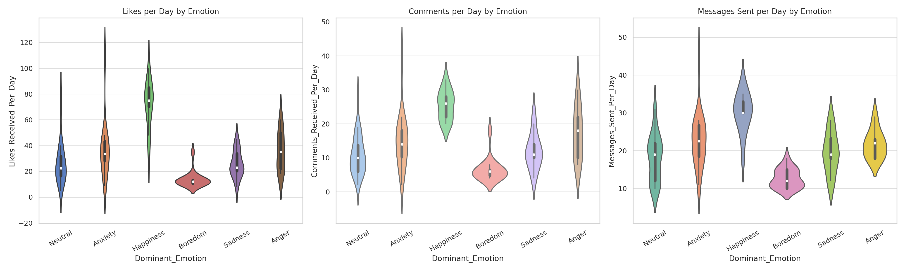
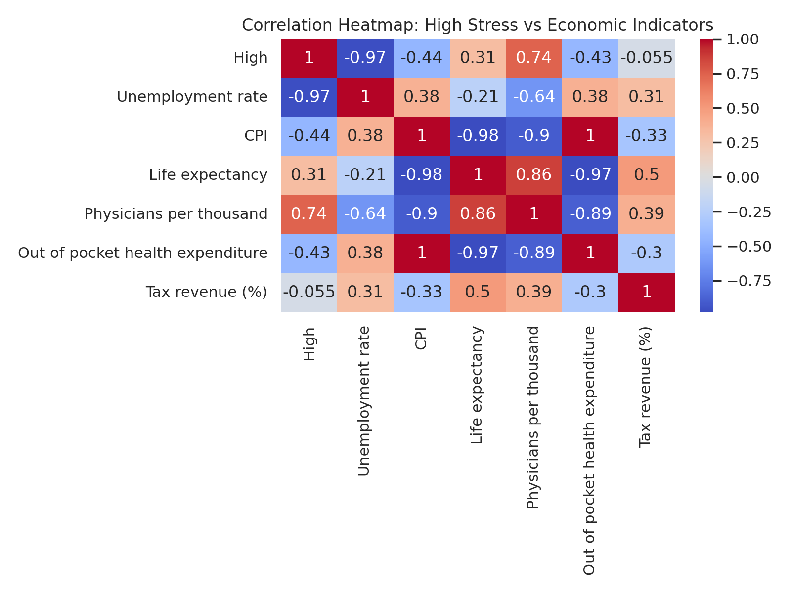
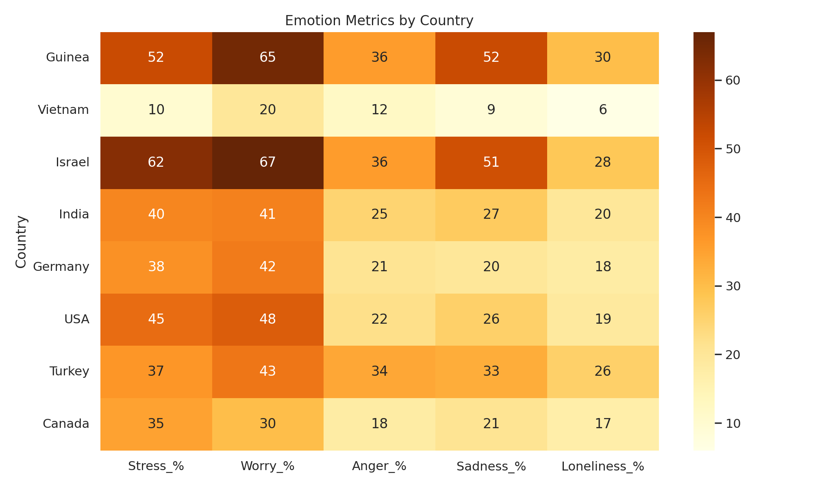

# **Stress Level Analysis Based on Socioeconomic and Environmental Factors**

A data science project analyzing the relationship between **stress levels** and **socioeconomic & environmental factors** such as temperature, unemployment rates, salary distribution, cost of living, and demographics. Using statistical analysis and machine learning to uncover patterns and predictive insights.

---

## **📌 Project Overview**
This project explores how external factors—including **economic indicators and climate conditions**—impact stress levels. By analyzing data from multiple sources, I aim to **identify key contributors to stress and develop predictive models**.

### **Key Research Questions**
- How do **unemployment rates and salary distribution** impact reported stress levels?
- Do **environmental conditions** (temperature, rainfall, pollution) correlate with higher stress levels?
- Do **physiological factors** like **respiration rate, body temperature, heart rate**, and **hours of sleep** influence stress?
- Are there **regional or demographic differences** in stress patterns?
- Does the **cost of living** influence mental health outcomes?

---

## **📌 Motivation**
Stress is something many of us experience, but it's also becoming a major public health issue worldwide.  
A recent survey ranked it just behind **cancer and mental health** as one of the biggest concerns, with countries like **South Korea and Turkey** reporting especially high levels.  
Younger people are often more affected, but even a significant number of older adults struggle with stress.  
This makes me wonder—**what’s driving this rise in stress?**  
Could factors like **economic instability, climate conditions, or health factors** play a role?  
**That’s what I want to explore in this project.**  
([Statista](https://www.statista.com/statistics/1057961/the-most-stressed-out-populations-worldwide/?utm_source=chatgpt.com))

---

## **📌 Datasets & Parameters**
This project integrates multiple datasets to analyze stress levels in relation to external factors.

### **1️⃣ Mental Health & Stress Dataset**
📂 **File:** `Stress_Data.csv`  
📌 **Source:** Kaggle Mental Health Dataset  
📌 **Includes:** Stress levels, mental health conditions, work-life balance.  
📌 **Covers:** Multiple countries (Country is a parameter).  

### **2️⃣ Gallup Stress Survey**
📂 **File:** `gallup_emotion_data_2023.csv`  
📌 **Source:** Gallup Global Emotions Report  
📌 **Includes:** Global stress trends based on survey data.  
📌 **Covers:** Multiple countries.  

### **3️⃣ Weather & Climate Dataset**
📂 **File:** `Weather_Data.csv`  
📌 **Source:** Kaggle Weather Dataset  
📌 **Includes:** Temperature, precipitation, pollution levels.  
📌 **Covers:** Multiple countries (Country is a parameter).  

### **4️⃣ Economic Indicators**

#### **a. Global Economic Data**
📂 **File:** `World_Economic_Data.csv`  
📌 **Source:** Kaggle - World Data 2023  
📌 **Includes:** GDP, income levels, unemployment rates.  
📌 **Covers:** Multiple countries (Country is a parameter).  

#### **b. Income Distribution (OECD)**
📂 **File:** `OECD_Income_Data.pdf`  
📌 **Source:** OECD Income Distribution Database  
📌 **Includes:** Salary distribution, income inequality.  
📌 **Covers:** Multiple countries (requires data extraction).  

---

## **📊 Data Collection & EDA**

### 🧼 Data Cleaning Summary

Before performing exploratory data analysis (EDA), we applied structured cleaning operations across all datasets to ensure consistency and reliability:

#### ✅ `social_media_stress.csv`
- Converted `Age` column to numeric format
- Removed rows with missing or invalid age values
- Cleaned dataset used to analyze usage time and engagement patterns by emotion

#### ✅ `Stress_Data.csv`
- Preserved full data but grouped by `Country` to calculate proportions of stress levels (`Low`, `Medium`, `High`)
- Used for country-level comparisons and merged with economic indicators

#### ✅ `World_Economic_Data.csv`
- Removed percentage symbols and commas from fields such as `Unemployment rate`, `CPI`, `Life expectancy`, and `Tax revenue (%)`
- Converted cleaned columns to numeric types
- Prepared for merging with stress summaries to enable correlation analysis

#### ✅ `Gallup_Stress_Report_2024.pdf`
- Extracted emotional indicators like `Stress`, `Worry`, `Anger`, `Sadness`, `Loneliness` and global experience indices
- Manually converted structured values into tabular form
- Saved as `gallup_emotion_data_2023.csv` for further use

#### ✅ `OECD_Income_Data.pdf`
- Sample disposable income values were extracted for selected countries
- Used to support high-level comparison between income and emotional health patterns

#### ✅ `data_stress.csv`
- Dropped rows with missing physiological data
- Removed unrealistic values such as:
  - Sleep hours < 1 or > 16
  - Heart rate < 40 or > 120
  - Body temperature < 90°F or > 105°F
  - Blood oxygen > 100
  - Eye movement > 120
  - Respiration rate > 40
  - Limb movement > 40
- Cleaned dataset will be used in the **machine learning phase** to **predict stress levels based on physiological signals**
- 📄 **Code file:** [`cleaned_data_stress.py`](data/cleaned_data_stress.csv)

---

### 🔗 Merged Dataset Overview

We created a merged dataset combining **country-level stress proportions** from `Stress_Data.csv` with **economic indicators** from `World_Economic_Data.csv`.

📄 **File:** `merged_stress_economics.csv`  
🧩 **Purpose:** To analyze how **economic and healthcare metrics** (e.g., life expectancy, unemployment, physician density) correlate with the **proportion of people reporting high stress**.

This merged dataset was the foundation for our **correlation heatmap** and multiple cross-variable analyses.

---

### 🧪 EDA: Likes, Comments & DMs vs Emotion

📂 **Dataset used:** `social_media_stress.csv`

We explored how different types of social media engagement (likes, comments, and messages) vary based on users' dominant emotional state using violin plots.

📄 **Code file**: [`eda_social_engagement.py`](eda/eda_social_engagement.py)

🧠 **Insights:**
- **Happiness** and **Anxiety** show broader spread in likes and message counts
- **Anger** and **Sadness** are associated with more DMs and comment activity
- Emotional state is reflected in the quantity and variability of online engagement

---

### 🔗 EDA: Correlation Between Stress and Economic Indicators

📂 **Datasets used:** `Stress_Data.csv` + `World_Economic_Data.csv`  
📄 **Merged file:** `merged_stress_economics.csv`

We analyzed how the proportion of people reporting **high stress** correlates with various economic and health indicators across countries.

📄 **Code file**: [`eda_stress_correlation.py`](eda/eda_stress_correlation.py)

🧠 **Insights:**
- High stress levels show **negative correlation** with **life expectancy** and **physician availability**
- Stress is **positively correlated** with **unemployment** and **CPI (inflation)**
- Strong economic and healthcare systems may contribute to reduced national stress

---

### 🧠 EDA: Emotional Metrics by Country (Gallup 2023)

📂 **Dataset used:** `Gallup_Stress_Report_2024.pdf` → structured as `gallup_emotion_data_2023.csv`

We visualized five key emotional indicators from Gallup’s global survey: **stress, worry, anger, sadness, and loneliness**.

📄 **Code file**: [`eda_emotion_heatmap.py`](eda/eda_emotion_heatmap.py)

🧠 **Insights:**
- **Israel** and **Guinea** show high levels across multiple emotions
- **Vietnam** and **Canada** report notably low emotional negativity
- The heatmap allows easy country-to-country emotional comparison

---

## 📌 Hypotheses Based on Visualizations

### 1️⃣ Social Media Activity Reflects Emotional State  
📂 **Dataset:** `social_media_stress.csv`  
📊 **Visualization:** Violin plots — Likes, Comments & DMs vs Emotion

> People who feel **anxious** or **sad** are more likely to send **DMs** or leave **comments** instead of just liking posts.  
> This might mean that people with negative emotions try to interact more with others online. It also shows that the **way people use social media** can tell us about their emotional state — not just how much time they spend on it.

---

### 2️⃣ Culture Might Help People Handle Economic Stress  
📂 **Dataset:** `gallup_emotion_data_2023.csv`, `oecd_income_sample.csv`  
📊 **Visualization:** Emotion Heatmap + OECD Income Overlay

> Some **low-income countries** (like **Vietnam**) still show high levels of **positive emotions**.  
> This suggests that **cultural or social support** in these countries might help people feel better, even if the economy isn’t strong.  
> So, **income alone doesn’t explain stress levels** — the environment people live in also matters a lot.

---
## 🧪 Hypothesis Testing

As part of the exploratory phase, we performed statistical hypothesis testing using **independent samples t-tests** to check whether observed differences in our data were statistically significant.

---

### 🧪 Hypothesis Test 1: Social Media Expression and Emotional State

📂 **Dataset used:** `social_media_stress.csv`  
📁 **Code file:** [`hypothesis1_social_media_test.py`](eda/hypothesis1_social_media_test.py)  
🧪 **Method:** Independent Samples t-Test

---

#### 📌 Hypothesis
- **H₀ (Null Hypothesis):** There is no difference in DMs or comments between users who report Anxiety or Sadness and those who don’t.
- **H₁ (Alternative Hypothesis):** Users who report Anxiety or Sadness send significantly more DMs or comments than others.

---

#### 📈 Test Results

- **Messages Sent Per Day:**  
  t = `1.2319`, p = `0.2209`

- **Comments Received Per Day:**  
  t = `0.0805`, p = `0.9360`

---

#### ✅ Conclusion
Since both p-values are greater than 0.05, we **fail to reject the null hypothesis**.  
Although visuals suggested that anxious or sad users might engage more via DMs or comments, the t-test shows that the difference is **not statistically significant** in this dataset.

---

### 🧪 Hypothesis Test 2: Culture May Buffer Against Economic Stress

📂 **Datasets used:** `cleaned_gallup_emotion_data.csv`, `cleaned_oecd_income_data.csv`  
📁 **Code file:** [`hypothesis2_income_vs_emotion_test.py`](eda/hypothesis2_income_vs_emotion_test.py)  
🧪 **Method:** Independent Samples t-Test

---

#### 📌 Hypothesis
- **H₀ (Null Hypothesis):** There is no difference in Positive Experience Index between high-income and low-income countries.
- **H₁ (Alternative Hypothesis):** Low-income countries report significantly different levels of positive emotion compared to high-income countries.

---

#### 📊 Test Results

- **Positive Experience Index (Low vs High Income):**  
  t = `-0.8188`, p = `0.4442`

---

#### ✅ Conclusion
Since the p-value is greater than 0.05, we **fail to reject the null hypothesis**.  
This means that in this dataset, there is **no statistically significant difference** in positive emotions between high-income and low-income countries — even though the original hypothesis suggested there might be.

---

Unfortunately, our alternative hypotheses about external factors contributing to stress levels were not supported, and we failed to reject the null hypotheses. Therefore, in the machine learning model, I will only use physiological features to predict stress levels.

## 📌 Phase 3: Machine Learning Model Design

We aim to develop machine learning models to **predict stress levels** from physiological signals such as heart rate, sleep, body temperature, etc.

### 🎯 Objective
To build and evaluate multiple supervised classification models using physiological inputs to determine the most accurate predictor of stress level.

### ⚙️ Dataset Used
📂 File: `data/cleaned_data_stress.csv`  
🎯 Target variable: `Stress Levels` (values: 0, 1, 2, 3)  
🧩 Features: `snoring range`, `respiration rate`, `body temperature`, `limb movement`, `blood oxygen`, `eye movement`, `hours of sleep`, `heart rate`

---

## **📌 Project Timeline**
| Date | Task |
|------|------|
| **March 10** | Submit project proposal (GitHub README) |
| **April 18** | Collect and clean data, perform EDA |
| **May 23** | Implement machine learning models |
| **May 30** | Final submission (GitHub repository) |

---

📌 _**This README was structured with guidance from ChatGPT to ensure clarity and completeness.**_
