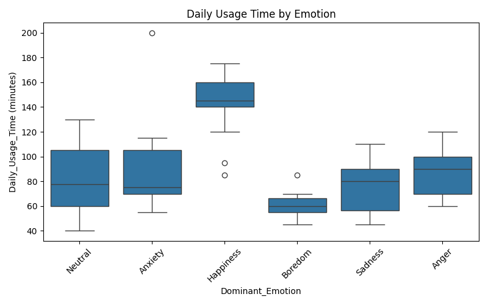

# **Stress Level Analysis Based on Socioeconomic and Environmental Factors**

A data science project analyzing the relationship between **stress levels** and **socioeconomic & environmental factors** such as temperature, unemployment rates, salary distribution, cost of living, and demographics. Using statistical analysis and machine learning to uncover patterns and predictive insights.

---

## **📌 Project Overview**
This project explores how external factors—including **economic indicators and climate conditions**—impact stress levels. By analyzing data from multiple sources, I aim to **identify key contributors to stress and develop predictive models**.

### **Key Research Questions**
- How do **unemployment rates and salary distribution** impact reported stress levels?
- Do **environmental conditions** (temperature, rainfall, pollution) correlate with higher stress levels?
- Are there **regional or demographic differences** in stress patterns?
- Does the **cost of living** influence mental health outcomes?

---

## **📌 Motivation**
Stress is something many of us experience, but it's also becoming a major public health issue worldwide.  
A recent survey ranked it just behind **cancer and mental health** as one of the biggest concerns, with countries like **South Korea and Turkey** reporting especially high levels.  
Younger people are often more affected, but even a significant number of older adults struggle with stress.  
This makes me wonder—**what’s driving this rise in stress?**  
Could factors like **economic instability or climate conditions** play a role?  
**That’s what I want to explore in this project.**  
([Statista](https://www.statista.com/statistics/1057961/the-most-stressed-out-populations-worldwide/?utm_source=chatgpt.com))

---

## **📌 Project Scope**
### **Country as a Parameter**
Instead of limiting the analysis to specific countries, this project considers **all available regions** in the dataset and uses **country as a parameter** in analysis. However, **comparisons will focus on**:
- 🇺🇸 **United States**
- 🇩🇪 **Germany**
- 🇰🇷 **South Korea**

This approach provides **flexibility** while still allowing deeper regional insights.

### **Comparison Factors**
- **Economic Factors:** Salary distribution, unemployment, cost of living.
- **Environmental Factors:** Temperature, precipitation, air pollution.
- **Demographic Trends:** Stress levels by age, gender, and location.

This ensures a **broad but structured** analysis.

---

## **📌 Datasets & Parameters**
This project integrates multiple datasets to analyze stress levels in relation to external factors.

### **1️⃣ Mental Health & Stress Dataset**
📂 **File:** `Stress_Data.csv`  
📌 **Source:** Kaggle Mental Health Dataset  
📌 **Includes:** Stress levels, mental health conditions, work-life balance.  
📌 **Covers:** Multiple countries (Country is a parameter).  

### **2️⃣ Gallup Stress Survey**
📂 **File:** `Gallup_Stress_Report_2024.pdf`  
📌 **Source:** Gallup Global Emotions Report  
📌 **Includes:** Global stress trends based on survey data.  
📌 **Covers:** Multiple countries.  

### **3️⃣ Weather & Climate Dataset**
📂 **File:** `Weather_Data.csv`  
📌 **Source:** Kaggle Weather Dataset  
📌 **Includes:** Temperature, precipitation, pollution levels.  
📌 **Covers:** Multiple countries (Country is a parameter).  

### **4️⃣ Economic Indicators**
#### **a. Quality of Life (U.S. Specific)**
📂 **File:** `Quality_of_Life_US.csv`  
📌 **Source:** Kaggle - U.S. Statewise Quality of Life Index  
📌 **Includes:** Cost of living, employment rates, and economic conditions.  
📌 **Covers:** United States (state-level).  

#### **b. Global Economic Data**
📂 **File:** `World_Economic_Data.csv`  
📌 **Source:** Kaggle - World Data 2023  
📌 **Includes:** GDP, income levels, unemployment rates.  
📌 **Covers:** Multiple countries (Country is a parameter).  

#### **c. Income Distribution (OECD)**
📂 **File:** `OECD_Income_Data.pdf`  
📌 **Source:** OECD Income Distribution Database  
📌 **Includes:** Salary distribution, income inequality.  
📌 **Covers:** Multiple countries (requires data extraction).  

---

## **📌 Hypotheses**
1️⃣ **Air Pollution & Extreme Weather → Increased Stress**  
   - Regions with **higher air pollution** or **frequent extreme weather (heat waves, storms, etc.)** may have **higher stress levels**, possibly due to **health concerns, discomfort, and disruptions in daily life**.  

2️⃣ **Social Media & Stress Perception**  
   - **Higher social media usage → Increased reported stress**  
     - Countries with **higher social media engagement** may show **higher self-reported stress levels**, possibly due to **information overload, comparison anxiety, or exposure to negative news**.  

---

## Data Collection & EDA

### ✅ Dataset Added:
- `social_media_stress.csv` (collected from Kaggle)
- Contains user-level data: age, gender, platform used, social media activity, and dominant emotional state

---

### 🧼 Cleaning Summary:
- Converted `Age` column to numeric
- Dropped 1 row with missing age
- Final dataset: **102 records**, 10 features

---

### 📊 EDA: Daily Usage Time vs Dominant Emotion

We explored how much time users spend on social media and how it relates to their dominant emotional state.

---

### 🧪 EDA: Likes, Comments & DMs vs Emotion

We explored how different types of social media engagement (likes, comments, and messages) vary based on users' dominant emotional state using violin plots.

📄 **Code file**: [`eda_social_engagement.py`](eda/eda_social_engagement.py)

🧠 **Insights:**
- **Happiness** and **Anxiety** show broader spread in likes and message counts
- **Anger** and **Sadness** are associated with more DMs and comment activity
- Emotional state is reflected in the quantity and variability of online engagement

---

## **📌 Project Timeline**
| Date | Task |
|------|------|
| **March 10** | Submit project proposal (GitHub README) |
| **April 18** | Collect and clean data, perform EDA |
| **May 23** | Implement machine learning models |
| **May 30** | Final submission (GitHub repository) |

---

📌 **_"This README was structured with guidance from ChatGPT to ensure clarity and completeness."_**
