# 📊 Stress Level Analysis

> 📁 **Note:** All analyses, code implementations, model training steps, visualizations, and detailed explanations are available in the [`DSA210.ipynb`](./DSA210.ipynb) notebook.

## 🎯 Motivation

Stress is something many of us, including me, are dealing with. It's rapidly becoming a major global public health concern. According to recent surveys (Statista), stress ranks just behind cancer and mental health issues as one of the most pressing challenges in several countries—especially in nations like South Korea and Turkey, where stress levels are notably high.

Younger populations, including students, are particularly vulnerable, although a considerable portion of older adults also report significant stress. This trend raises a crucial question: what factors are driving this surge in stress levels?

In this project, I aim to explore whether internal health-related and behavioral factors—such as sleep habits, fatigue, caffeine use, and physical activity—can be used to explain and even predict an individual’s stress level. Using a cleaned dataset on students’ lifestyle and sleep patterns, I will apply statistical analysis and machine learning techniques to identify potential stress indicators and build predictive models.

---

## 🗃️ Dataset Description

The dataset was originally obtained from a public source and contains various attributes such as:

- Sleep quality and duration  
- Study habits  
- Mental health and stress levels  
- Academic outcomes (e.g., GPA)

I cleaned the dataset to remove invalid entries, convert categorical variables to numeric formats, and drop irrelevant features. Below is the cleaning code.

📂 **Raw Data File:**
- [Student Insomnia and Educational Outcomes Dataset.csv](./raw_data/Student%20Insomnia%20and%20Educational%20Outcomes%20Dataset.csv)

📂 **Cleaned Data:**
- [Clean.csv](./cleaned_data/Clean.csv)

---

## 🧼 Data Cleaning Summary

To prepare the dataset for analysis, we conducted the following cleaning steps:

1. **Removed unnecessary columns**: The `Timestamp` column was dropped as it provided no analytical value.
2. **Standardized column names**: I stripped question numbers and simplified column names for clarity and ease of use.
3. **Mapped categorical responses to numerical values**: Multiple survey responses (e.g., sleep frequency, stress levels, study habits) were converted into ordinal numeric scales using custom mappings. This allows for better compatibility with statistical analysis and machine learning models.

These preprocessing steps ensured that the dataset was tidy, numerical, and ready for exploratory analysis and modeling.

---

## 📊 Exploratory Data Analysis (EDA)

To begin the analysis, I first look at general summary statistics and visualize the distribution of key features in the dataset. This helps me understand the range, central tendency, and variation in behavioral factors that may relate to stress levels.

📊 **EDA Visualizations:**

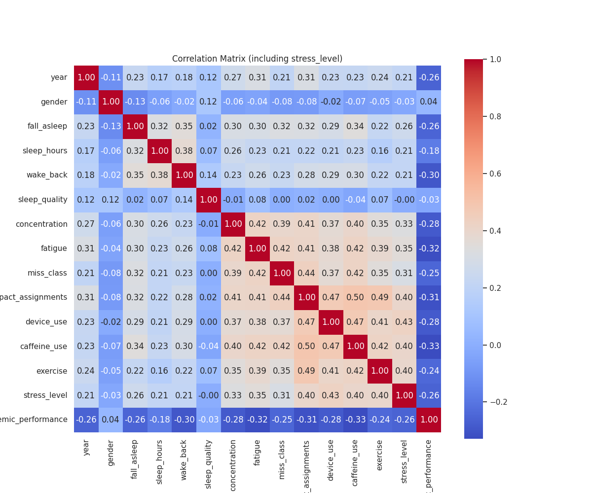  
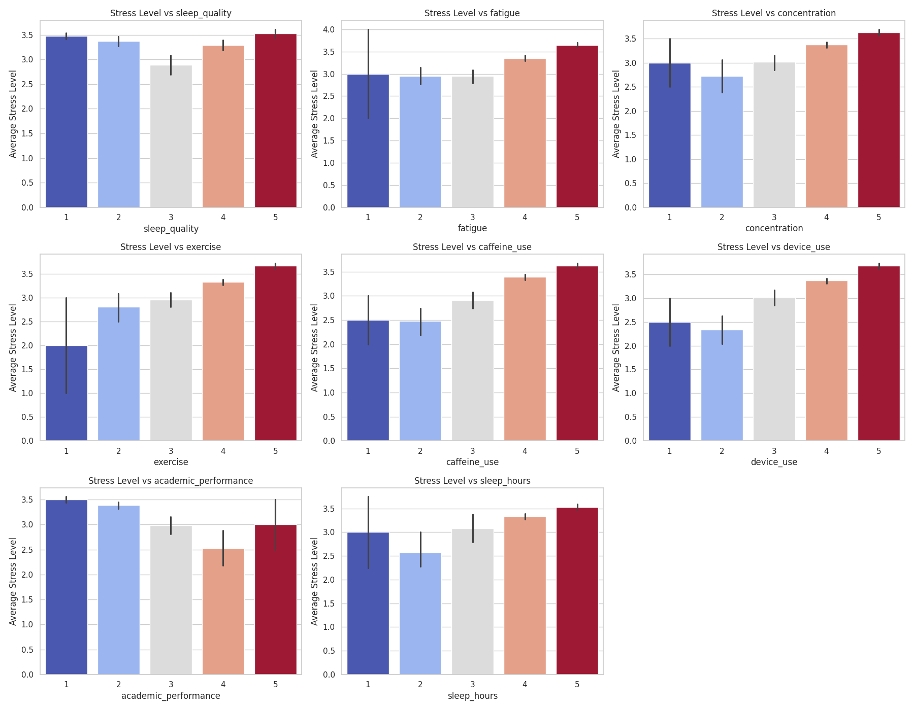  

---

## 🧪 Sampling for Hypothesis Testing

While my full dataset includes 791 student responses, conducting hypothesis testing on the entire dataset often results in extremely small p-values. Even very small differences between groups can become statistically significant.

To address this, I draw a random sample of 100 students from the dataset. This smaller subset helps us:

- Reduce statistical overpowering  
- Obtain p-values that are easier to interpret in real-world terms

If I don't do this, p-value will be extremely small which python rounds it to zero.

I use this sampled data to perform hypothesis testing and visualize group-level differences in stress levels.

📄 **Sampled Dataset Used for Hypothesis Testing:**  
- [Sampled_100.csv](./eda/Sampled_100.csv)

---

## 🧪 Hypothesis Testing

In this section, I test whether specific behavioral and lifestyle factors significantly influence stress levels among students. I selected two hypotheses based on plausible real-world relationships:

---

### 🔹 Hypothesis 1: Sleep Hours and Stress Level

**Question:** Does the average amount of sleep a student gets significantly affect their stress level?

**Null Hypothesis (H₀):** The mean stress level is the same across all sleep hour groups.  
**Alternative Hypothesis (H₁):** Sleep hours could affect the stress level across groups.

I perform an **ANOVA** test to compare mean stress levels between groups categorized by average sleep duration.

---

### 🔹 Hypothesis 2: Caffeine Use and Stress Level

**Question:** Is there a significant relationship between how frequently students consume caffeine and their stress level?

**Null Hypothesis (H₀):** There is no correlation between caffeine use and stress level.  
**Alternative Hypothesis (H₁):** There is a correlation between caffeine use and stress level.

I use the **Spearman rank correlation** to test for a non-linear but monotonic relationship between these ordinal features.

---

## 📈 Hypothesis Testing Results

### 🔹 Hypothesis 1: Sleep Hours and Stress Level

I performed a One-Way ANOVA test on the sampled data to assess whether average sleep duration has a statistically significant effect on students' stress levels.

- **Result:** The ANOVA test returned a p-value of _0.002543_.  
- **Conclusion:** Since the p-value was below 0.05, I reject the null hypothesis. This suggests that the amount of sleep a student gets **does have a significant effect** on their stress level.

---

### 🔹 Hypothesis 2: Caffeine Use and Stress Level

I used the Spearman rank correlation test to examine whether there's a monotonic relationship between how frequently students consume caffeine and their reported stress level.

- **Result:** The test yielded a Spearman correlation of _0.496_ and a p-value of _0.000000_.  
- **Conclusion:** The p-value is extremely small and below 0.05, so we reject the null hypothesis. This indicates a statistically significant correlation between **caffeine consumption and stress level** — as caffeine use increases, stress level tends to rise as well.

These findings highlight the role of sleep and caffeine intake in student stress, supporting the idea that behavioral factors meaningfully contribute to mental well-being.

---

## 📊 Visualizing Hypothesis Test Results

To better understand the patterns found in my hypothesis tests, I use bar plots to visualize the relationship between:

- Average sleep hours and stress level  
- Caffeine use frequency and stress level

These visualizations help illustrate how these variables influence student stress.

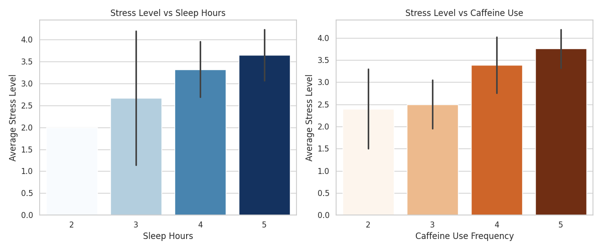

--- 

# 🤖 Machine Learning Modeling

In this phase, I aim to build predictive models to estimate a student's stress level based on behavioral and physiological features. My goal is to assess whether these features can reliably predict stress categories using supervised classification techniques.

I will:

- Split the data into training and testing sets  
- Train multiple models (e.g., Random Forest, KNN)  
- Evaluate model accuracy and compare performance  
- Visualize ROC-AUC to measure classification quality  

---

## 🎯 Focused ROC Curve: Stressed vs. Not Stressed

To better identify students under high stress, I transformed the original 4-class stress levels into a binary classification:

- **Not Stressed (0):** No stress or low stress  
- **Stressed (1):** High stress or extremely high stress  

I then plot the ROC curve to evaluate each model’s ability to distinguish stressed students from those not under significant stress. This focused evaluation helps assess real-world usefulness in detecting at-risk individuals.

---

## 👔 Standardizing the Data

Before training my machine learning models, I standardize the dataset so that all features are on the same scale. This is especially important for models like KNN, SVM, and logistic regression, which are sensitive to feature magnitude.

---

## 🏢 Multi-Model Comparison: Binary Stress Classification

With the stress levels now grouped into a binary format (Stressed vs Not Stressed), I train and evaluate multiple machine learning models to identify students under significant stress.

Each model will be evaluated using:

- **Accuracy**: Overall prediction correctness  
- **ROC-AUC Score**: Ability to distinguish stressed students from non-stressed ones  
- **ROC Curve**: Visual performance comparison

---

## 🌲 Random Forest

Random Forest is an ensemble learning method that builds multiple decision trees and averages their predictions to improve accuracy and reduce overfitting. 

It is used here due to its strong performance on structured data and its robustness to noise.

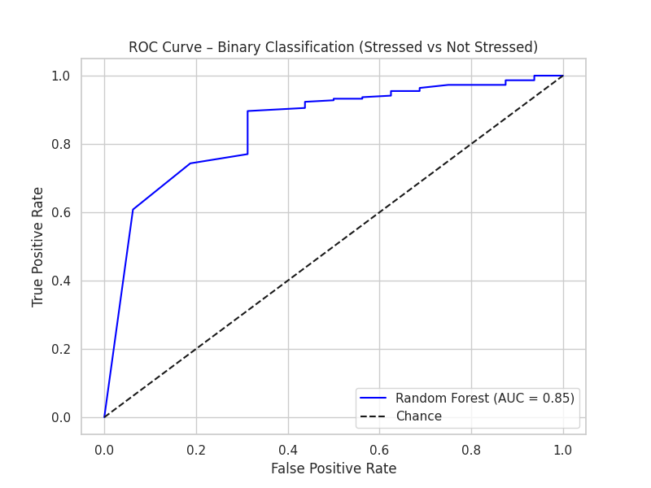

---

## 📍 K-Nearest Neighbors (KNN)

K-Nearest Neighbors (KNN) is a simple, instance-based learning algorithm that classifies a sample based on the majority class of its closest training samples.

I evaluate it using accuracy and ROC-AUC to see how well it distinguishes stressed from non-stressed students.

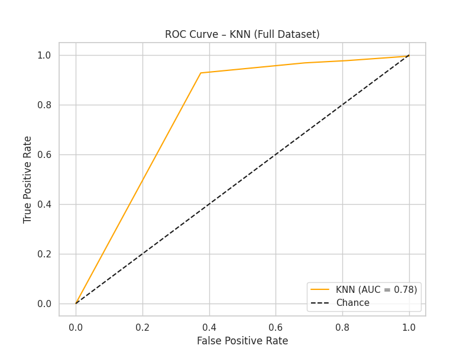

---

## 📎 Support Vector Machine (SVM)

Support Vector Machines are powerful classifiers that aim to find the optimal decision boundary (hyperplane) that separates classes. In binary stress classification, SVM attempts to separate stressed and non-stressed students using maximum margin.

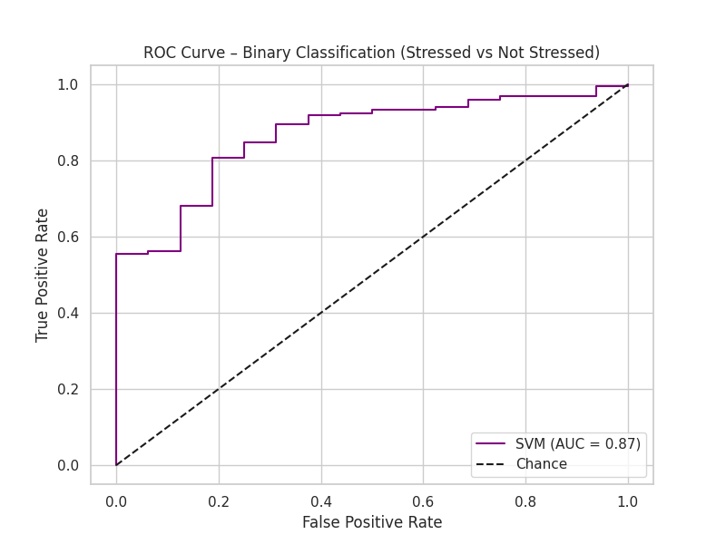

---

## ⚡ XGBoost (Extreme Gradient Boosting)

XGBoost is a powerful tree-based ensemble learning algorithm known for its speed and performance. It uses gradient boosting to build decision trees sequentially, optimizing for prediction accuracy.

In this step, I train XGBoost to predict student stress (binary: stressed vs not stressed), and evaluate its performance using accuracy and ROC-AUC.

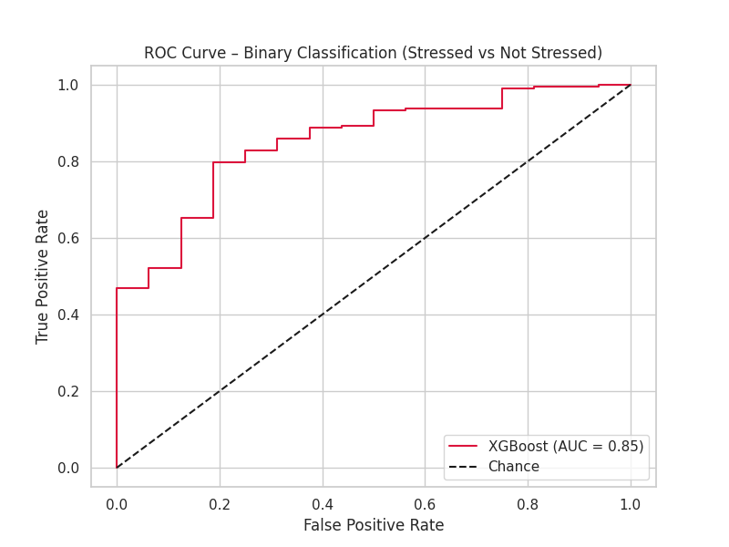

---

## 📉 Logistic Regression (Binary Classification)

Logistic Regression is a linear model that predicts probabilities of class membership. It serves as a strong and interpretable baseline, especially for small or structured datasets. I train it with class balancing enabled and evaluate it using accuracy and ROC-AUC.

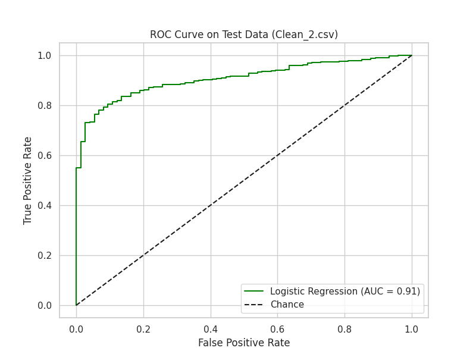

---

## 🏁 Final Model Comparison

After training all models on the same dataset using binary stress labels (Stressed vs Not Stressed), I now compare their performance using ROC curves.

The ROC-AUC score provides a robust measure of each model’s ability to distinguish between stressed and non-stressed students. Below, we visualize and compare the ROC curves of Logistic Regression, Random Forest, K-Nearest Neighbors (KNN), Support Vector Machine (SVM), and XGBoost.

This comparison helps identify the most effective model for detecting high-stress students based on behavioral and physiological indicators.

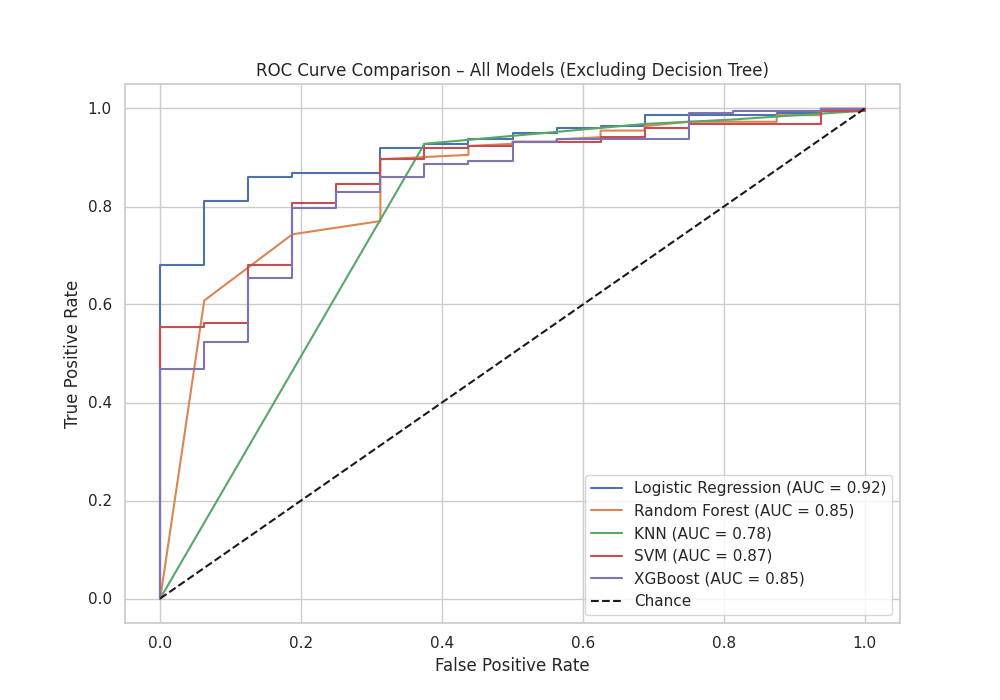

---

## 🔢 Confusion Matrix Comparison

To better understand how each model makes predictions, I visualize their confusion matrices. Each matrix shows the number of correct and incorrect predictions made by the model, broken down by the two classes:

- **True Positives (bottom-right):** Correctly predicted "Stressed" students  
- **True Negatives (top-left):** Correctly predicted "Not Stressed" students  
- **False Positives (top-right):** Predicted "Stressed" when actually not  
- **False Negatives (bottom-left):** Missed actual "Stressed" cases  

This breakdown complements the ROC-AUC analysis by showing where each model struggles — particularly in handling class imbalance or distinguishing borderline cases.

---

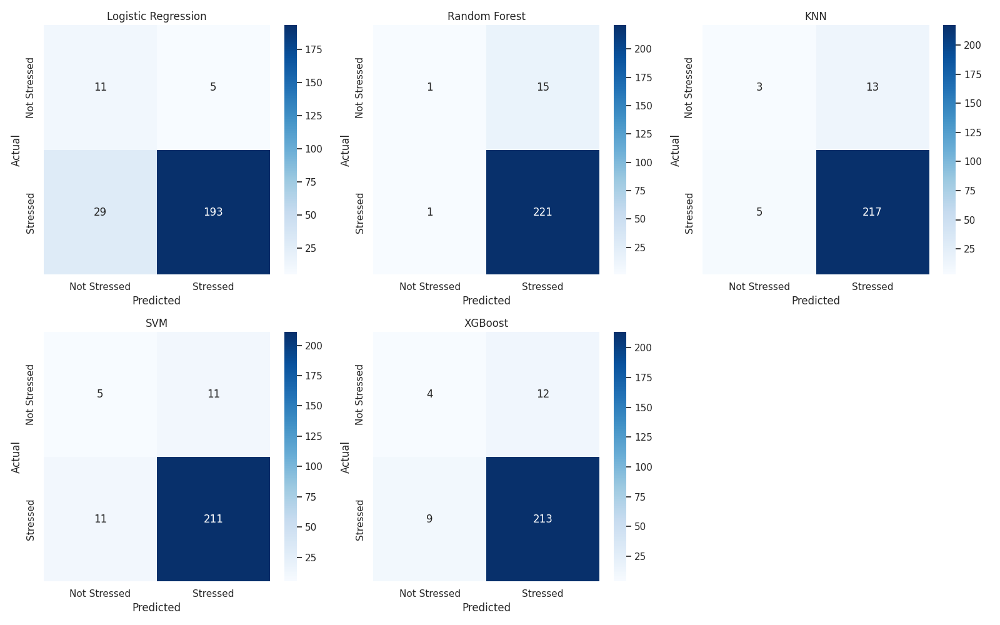

## 🧠 Interpretation of Confusion Matrices

The confusion matrices for the different models reflect the nature of our classification problem, which involves an imbalanced dataset with more "Stressed" cases than "Not Stressed."

- **Class Imbalance Effect:** Most predictions fall into the "Stressed" category, consistent with the higher number of stressed samples in both the training and test sets. This imbalance naturally biases the models toward predicting the majority class more often.

- **Model Performance Overview:**
  - **Random Forest** shows the best balance, with relatively few false positives and false negatives, aligning with its strong accuracy and ROC-AUC scores.
  - **Logistic Regression** and **SVM** also perform well but produce a slightly higher number of misclassifications.
  - **K-Nearest Neighbors (KNN)** and **XGBoost** have more false positives, indicating some tendency to incorrectly label "Not Stressed" students as stressed.

- **Practical Implication:** The models are generally good at identifying stressed students but occasionally misclassify some non-stressed students, which may be acceptable depending on the application context (e.g., prioritizing catching stressed students for intervention).

---

## 🧪 Testing Models on New Dataset

I have a new dataset collected by the same institution but in a different year. My goal is to:

- Clean and preprocess this new data similarly to the original dataset.  
- Apply one of the models trained on the previous dataset to this new data to test their generalization performance.

📂 **Raw Data File:**
- [Student Insomnia and Educational Outcomes Dataset_version-2.csv](./raw_data/Student%20Insomnia%20and%20Educational%20Outcomes%20Dataset_version-2.csv)

---

## 🧼 Initial Data Cleaning and Encoding for New Dataset

In this step, I clean the new dataset by handling missing values and applying the same categorical mappings as the original dataset. The target variable transformation into binary labels will be done later.

📂 **Cleaned Data:**
- [Clean_2.csv](./cleaned_data/Clean_2.csv)

---

## 🧩 Creating Binary Stress Label and Splitting Data

I transform the stress level into a binary target:

- **1 and 2 → Not Stressed (0)**  
- **3 and 4 → Stressed (1)**

Then I perform a stratified train-test split to maintain class balance in both sets.

---

## 🧪 Testing Pretrained Models on New Dataset

After training models on the original dataset, I evaluate their performance on a new dataset collected separately. This process assesses the generalization ability of the models in detecting stress levels on unseen data. Since I used XGBoost, I don't even have to standarize it.

---

## 📊 Now, let's examine the confusion matrix to understand how well the model classifies stressed and not stressed students.

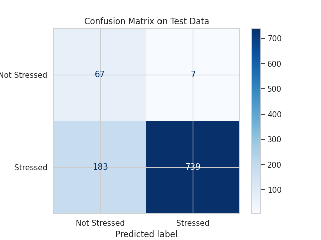  

---

## 🌍 Model Generalization to New Dataset

The XGBoost model trained on the original dataset demonstrates strong performance when tested on the new dataset.

- The **ROC curve** shows a high AUC score of **0.98**, indicating excellent discriminative ability between stressed and not stressed students.  
- The **confusion matrix** reveals that the model correctly classifies the majority of cases, with relatively few misclassifications.

These results confirm that the model generalizes well across datasets collected at different times, validating its robustness and practical applicability for stress level prediction in similar student populations.

---

## ✅ Final Remarks

In this project, I explored the relationship between students' behavioral and physiological factors and their perceived stress levels. Through extensive data cleaning, hypothesis testing, and machine learning modeling, I found that features like sleep quality and caffeine consumption have a measurable impact on stress.

By transforming stress into a binary classification problem and evaluating multiple models — including Logistic Regression, Random Forest, KNN, SVM, and XGBoost — I was able to build predictive systems that can effectively identify students under high stress with strong accuracy and generalization across datasets.

This work is important because it demonstrates how data-driven approaches can be used to uncover hidden patterns in mental health and support early detection efforts. In educational environments where stress is often overlooked, such tools could contribute to more timely interventions and better student well-being.

---

> 🧠 **Note on AI Assistance:**  
> Parts of this project — including code debugging, README formatting, and markdown structuring — were supported with the help of ChatGPT. All outputs were carefully reviewed, edited, and finalized by me.
